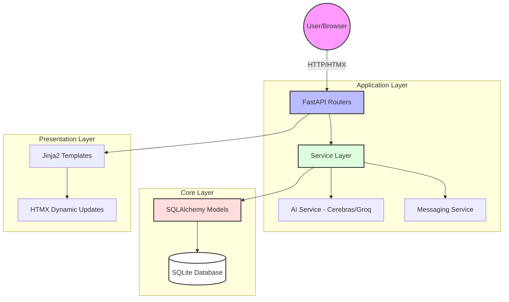

# Project Architecture

The **AI Ready CRM (D4)** is built using a modern, modular architecture centered around **FastAPI** and **SQLAlchemy**. It follows a standard Layered Architecture pattern to ensure scalability and maintainability.

## High-Level Architecture Diagram

## Architectural Layers

### 1. Presentation Layer
- **Jinja2 Templates**: Server-side rendering for the CRM interface.
- **HTMX**: Enables reactive UI components without full page reloads.
- **Vanilla CSS/JS**: Salesforce-aligned styling and object-specific frontend logic.

### 2. Application Layer (FastAPI Routers)
- **Web Routers**: Located in `app/api/routers/`, these handle request routing and template rendering.
- **Form Routers**: Handle object creation and update logic via modals.
- **Messaging Router**: Manages SMS/LMS communication workflows.

### 3. Service Layer (Business Logic)
- **Domain Services**: Encapsulate business rules for `Contact`, `Lead`, `Opportunity`, etc.
- **AI Service**: Integrates with Cerebras and Groq for real-time summaries and deal insights.
- **Search Service**: Provides multi-object global search capabilities.

### 4. Data Access Layer (ORM)
- **SQLAlchemy 2.0+**: Provides a declarative mapping of Python objects to database tables.
- **BaseModel**: A common base class providing audit fields (`created_at`, `updated_at`) and Soft Delete (`deleted_at`).

### 5. Persistence Layer
- **SQLite**: A lightweight, file-based relational database used for storage.

## Key Design Principles
- **Modularization**: Code is decomposed into object-specific modules to prevent regression issues.
- **Soft Deletion**: All primary entities support non-destructive deletion.
- **AI-First**: Intelligence is baked into the core workflows (summarization, insights).
