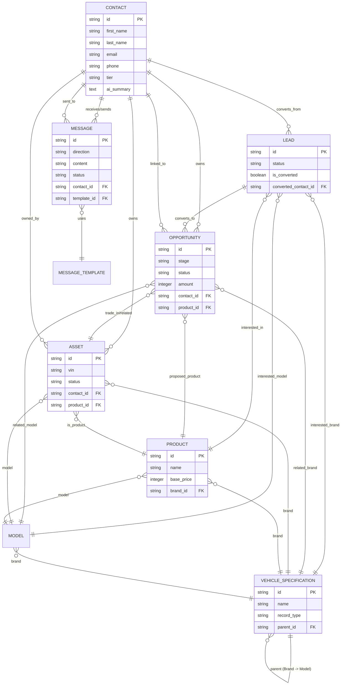

# Entity Relationship Diagram (ERD)

The database schema for the **AI Ready CRM (D4)** follows a relational model optimized for the automotive industry.

## Mermaid ERD

## Core Entities

### Contact
The central entity representing an individual or business. Per the recent refactor, it consolidates Account data and serves as the primary lookup for most other objects.

### Lead
Represents a potential customer before qualification. Can be converted into a Contact and an Opportunity.

### Opportunity
A sales deal in progress. Tracks the stage, amount, and related products/contacts.

### Asset
A specific vehicle owned by a contact (identified by VIN). Closely mapped to Products and Brands.

### Product & Vehicle Specification
- **Vehicle Specification**: Hierarchical data for Brands and Models.
- **Product**: Abstract catalog items (e.g., "BMW 3 Series 2024") that can be linked to Assets and Opportunities.

### Messaging
- **Message**: Log of SMS/LMS communication.
- **Message Template**: Reusable content for automated or manual messaging.
