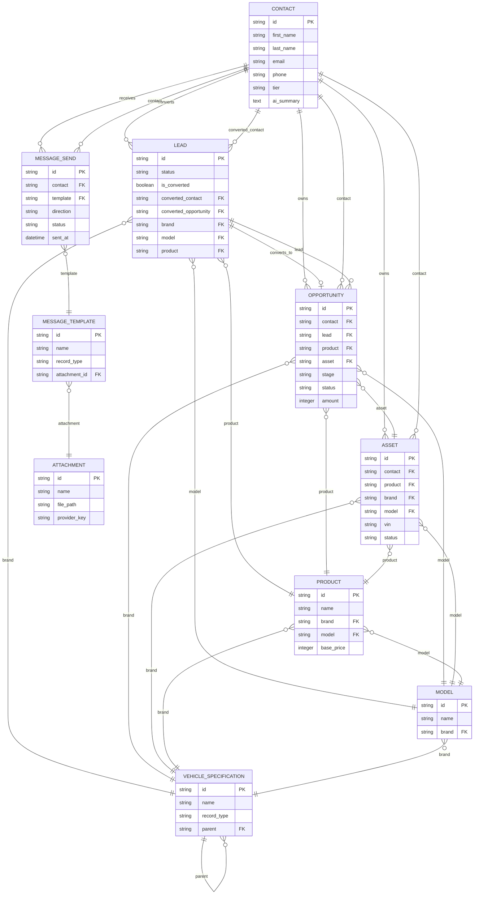

# Entity Relationship Diagram

This ERD reflects the active ORM models defined in `db/models.py`.

## Mermaid ERD

## Notes

- `BaseModel` supplies `created_at`, `updated_at`, and `deleted_at` to most primary entities.
- `ServiceToken` exists for external service credentials and is intentionally omitted from the main ERD because it is operational rather than CRM-domain data.
